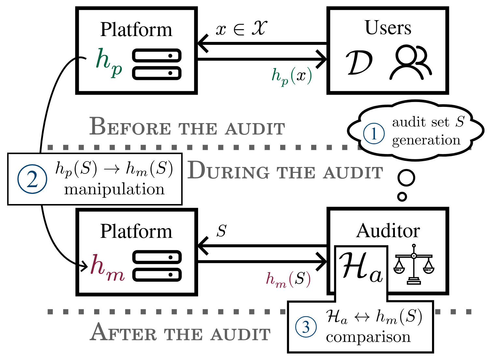
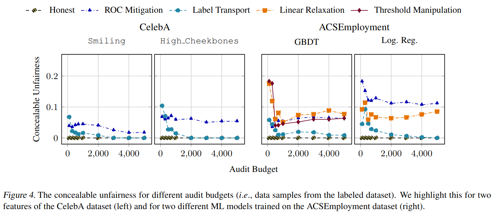

+++
title = "Robust ML Auditing using Prior Knowledge"
date = 2025-05-01
description = "How can auditors use prior knowledge to improve the robustness of their audit?"

[extra]
paper_authors=[
    {name="Jade Garcia Bourrée*", affiliation="Inria, Université de Rennes"},
    {name="Augustin Godinot*", url="https://grodino.github.io",affiliation="Université de Rennes, Inria, IRISA/CNRS, PEReN"},
    {name="Martijn De Vos", url="https://devos50.github.io/", affiliation="EPFL"},
    {name="Milos Vujasinovic", url="https://mvujas.com/", affiliation="EPFL"},
    {name="Sayan Biswas", url="https://blitzwas.github.io/", affiliation="EPFL"},
    {name="Gilles Tredan", url="https://homepages.laas.fr/gtredan/", affiliation="LAAS, CNRS"},
    {name="Erwan Le Merrer", url="https://erwanlemerrer.github.io/", affiliation="Inria"},
    {name="Anne-Marie Kermarrec", url="https://people.epfl.ch/anne-marie.kermarrec", affiliation="EPFL"}
]
+++

{{ paper(url="https://openreview.net/forum?id=AiaVCVDuxF", conference="ICML25")}}
{{ arxiv(url="https://arxiv.org/abs/2505.04796")}}
{{ code(url="https://github.com/grodino/merlin" )}}

Do you remember Dieselgate? The car computer would detect when it was on a test-bench and reduce the
engine power to fake environmental compliance. Well, this can happen with AI regulation too.

An audit is pretty straightforward.
1. I, the auditor 🕵️ come up with questions to ask your model. 
2. You, the platform 😈 answer my questions.
3. I look at your answers and decide whether your system abides by the law by computing a series of
   aggregate metrics.

<figure style="width: 20em" class="align-center">
    
    
<figcaption>Interactions between the platform, the auditor and the users</figcaption>

</figure>

Now, you know the metric, you know the questions, and I don't have access to your model.
Thus, nothing prevents you from manipulating the answers of your model to pass the audit. 
And this is very easy! In fact, **any fairness mitigation method can be transformed into an audit
manipulation attack.**

There are two main approaches to avoid manipulations.
- 🔒Crypto guarantees: the model provider is forced to commit their model and sign every answer.
- 📐Clever ML tricks: the auditor uses information about the model (training data, model structure,
  ...) to understand what is a "good answer". 

In this paper, we formalize the second approach as a search for efficient "audit priors". 
We instantiate our framework with a simple idea: just look at the accuracy of the platform's answers.
Our experiments show that this can help reduce the amount of unfairness a platform could hide.

<figure style="width: 30em" class="align-center">
    
    
<figcaption>The amount of unfairness a platform can hide as a function of the auditor query budget</figcaption>

</figure>

If you want to read more about this, I encourage you to read the
[paper](https://arxiv.org/abs/2505.04796), but not only! Recently, there has been a lot of exciting
works on robust audits, here are a few I enjoyed:
- [Verifiable evaluations of machine learning models using zkSNARKs](https://arxiv.org/abs/2402.02675)
- [P2NIA: Privacy-Preserving Non-Iterative Auditing](https://arxiv.org/abs/2504.00874)
- [ExpProof : Operationalizing Explanations for Confidential Models with ZKPs](https://arxiv.org/abs/2502.03773)
- [On the relevance of APIs facing fairwashed audits](https://arxiv.org/abs/2305.13883)
- [OATH: Efficient and Flexible Zero-Knowledge Proofs of End-to-End ML Fairness](https://arxiv.org/abs/2410.02777)