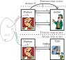
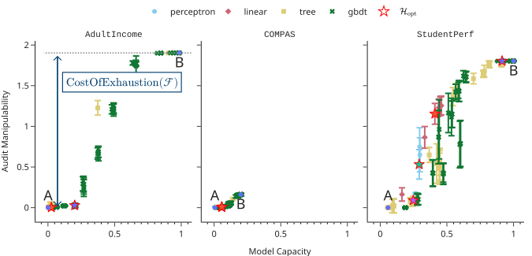
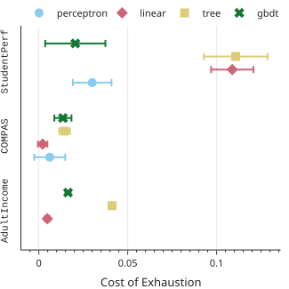

+++
title = "Under manipulations, are there AI models harder to audit?"
date = 2023-10-01
description = "Under platform manipulations, AI model cannot be audited in black box more robustly than by random sampling."

[extra]
paper_authors=[
    {name="Augustin Godinot", url="https://grodino.github.io",affiliation="Université de Rennes, Inria, IRISA/CNRS, PEReN"},
    {name="Erwan Le Merrer", url="https://erwanlemerrer.github.io/", affiliation="Inria"},
    {name="Gilles Tredan", url="https://homepages.laas.fr/gtredan/", affiliation="LAAS, CNRS"},
    {name="Camilla Penzo", url="https://chairgovreg.fondation-dauphine.fr/fr/camilla-penzo", affiliation="PEReN"},
    {name="François Taïani", url="https://team.inria.fr/wide/team/francois-taiani/", affiliation="Université de Rennes, Inria, IRISA/CNRS"}
]
+++

{{ paper(url="https://openreview.net/forum?id=Q40m3Gcsd9", conference="SaTML24")}}
{{ arxiv(url="https://arxiv.org/abs/2402.09043")}}
{{ slides(url="slides.pdf") }}
{{ poster(url="poster.pdf") }}

You are a regulator, I am a platform hosting a Machine Learning (ML) model. You want to verify
that my model does not discriminate marginalized populations. I want to have the most accurate model
in average (yes, I like to brag about that 97.98989% accuracy). 

<figure style="width: 20em" class="align-center">
    
    
<figcaption>Threat model of the manipulation-proof auditing game</figcaption>

</figure>

To verify that I am not too *unfair*, you conduct an audit: you ask me questions and I have to
answer them. The thing is, *I am a sneaky platform*. I don't want to spend time to have a fair and
accurate model. Thus, during the audit, I design answers to your questions as fair as I can, but
after the audit, I will change my model back to the most accurate model I have. I know that you are
not naive, I know that you'll check if I kept the same answers on your questions from time to time.
**Can you craft questions that make it hard for me to manipulate the model after the audit while
keeping the same answers on your questions?**

We build on a previous work by [Yan and Zhang](https://proceedings.mlr.press/v162/yan22c/yan22c.pdf)
and proved that, unfortunately, it is not possible to achieve significantly better performance than
asking random questions. 

## Larger models are harder to audit

We saw that for some types of models (the ones that have a *high* capacity), despite how clever any
audit algorithm might be, it will not get better performance than randomly sampling queries. In
practice, what about commonly used models?

<figure style="width: 50em" class="align-center">
    
    
<figcaption>The effect of model capacity on the manipulability of the audit</figcaption>

</figure>

It turns out that just by increasing the capacity (tree depth, number of trees, neurons...), the platform can always arbitrarily increase the manipulability of the audit. If you want to know more about about how to measure this notion of capacity, and audit manipulability, checkout the paper 😉.

## Manipulations are cheap for the platform

Thanks to the capacity of existing models, it is easy for the platform to appear fair during the audit and then use an other model. Yet, is the accuracy of this new model be as high as if the platform did not have to jump through all those hoops to game the audit?

<figure style="width: 20em" class="align-center">
    
    
<figcaption>The cost of exhaustion for different types of models</figcaption>

</figure>

The cost of exhaustion is a measure of this accuracy drop. It turns out that for most model types,
the impact on the accuracy is minimal.

## An attempt at relaxing the Manipulation-Proof auditing problem
In a earlier work, I attempted to relax the notion of Manipulation-Proof auditing. You can have a
look at the [paper](https://pfia23.icube.unistra.fr/conferences/rjcia/Actes/RJCIA2023_paper_10.pdf)
and [slides](PFIA-2023-07.pdf).

