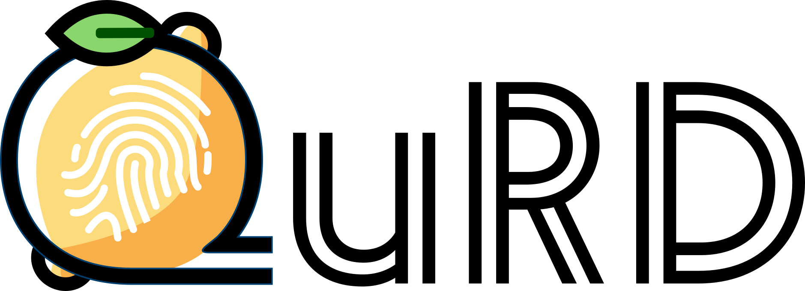

+++
title = "Queries, Representation & Detection: The Next 100 Model Fingerprinting Schemes"
date = 2025-02-26
description = "How do we evaluate fingerprinting methods and how can we do better?"

[extra]
paper_authors=[
    {name="Augustin Godinot", url="https://grodino.github.io",affiliation="Université de Rennes, Inria, IRISA/CNRS, PEReN"},
    {name="Erwan Le Merrer", url="https://erwanlemerrer.github.io/", affiliation="Inria"},
    {name="Camilla Penzo", url="https://chairgovreg.fondation-dauphine.fr/fr/camilla-penzo", affiliation="PEReN"},
    {name="François Taïani", url="https://team.inria.fr/wide/team/francois-taiani/", affiliation="Université de Rennes, Inria, IRISA/CNRS"},
    {name="Gilles Tredan", url="https://homepages.laas.fr/gtredan/", affiliation="LAAS, CNRS"},
]
+++

{{ paper(url="https://ojs.aaai.org/index.php/AAAI/article/view/33848", conference="AAAI25") }}
{{ arxiv(url="https://arxiv.org/abs/2412.13021") }}
{{ poster(url="poster.pdf") }}
{{ code(url="https://github.com/grodino/QuRD") }}

When auditing a machine learning (ML) model, regardless of the access the auditor might have to the
model, there is always the risk of the ModelSwap™ attack. Think of the
[Dieselgate](https://en.wikipedia.org/wiki/Volkswagen_emissions_scandal) scandal. I show you a very
compliant, albeit less powerful model during the audit but swap it for an other model when serving
the users. A way to mitigate the ModelSwap™ attack is to monitor the user-facing model and check if
it is the same that we saw during the audit. 

Beyond auditing, comparing models is a fundamental task in ML. Perfomance evaluation, performance
prediction, model provenance, model ownership resolution, unlearning verification are all based on
some notion of (pseudo)-metric between models.
