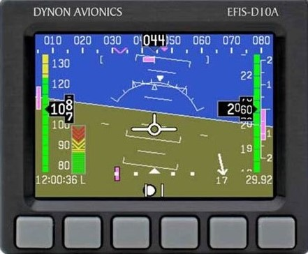

+++
title = "Real-time artificial horizon"
date = 2020-05-02
description = "Implementation of Hardware Abstraction Layer modules for the screen and I2C peripherals on the STM32F746 processor. Developed an artificial horizon as an example."
+++

For a school project I implemented a crude artificial horizon on a STM32F746-DISCO board. This was the occasion to learn embedded-rust. The code of the Hardware Abstraction Layer (HAL) I contributed to can be found [here](https://github.com/stm32-rs). The code of my crude artificial horizon can be found [here](artificial-horizon.zip).

<figure style="width: 10em" class="align-center">
    
    <figcaption>A digital artificial horizon</figcaption>
</figure>

First, because I needed I2C to communicate with an Inertial Measurement Unit (IMU), I had to implement the protocol for the specific STM32F7 microcontroller family. I took some inspiration from existing I2C implementation for the F4 family and ported it to my microcontroller family. This resulted in a contribution to [stm32f7-hal](https://github.com/stm32-rs/stm32f7xx-hal/pull/43).

Then, because I needed to use the display of the STM32F746-DISCO board, I implemented a driver for the LTDC (LCD-TFT Display Controller Interface) peripheral of the STM32F7xx microcontrollers. This was more difficult since no implementation existed in existing HALs. Diving in the details of the LTDC, I also worked on DMA transfers. This also resulted in contributions to stm32f7-hal: [1](https://github.com/stm32-rs/stm32f7xx-hal/pull/40) and [2](https://github.com/stm32-rs/stm32f7xx-hal/pull/41).

This project was a great opportunity to discover the embedded-rust ecosystem and community. Being part of the course *C programming for embebedded systems*, I also made a small introduction of [rust-lang](https://rust-lang.org) to my teachers who wanted to know more about "the replacement of C".